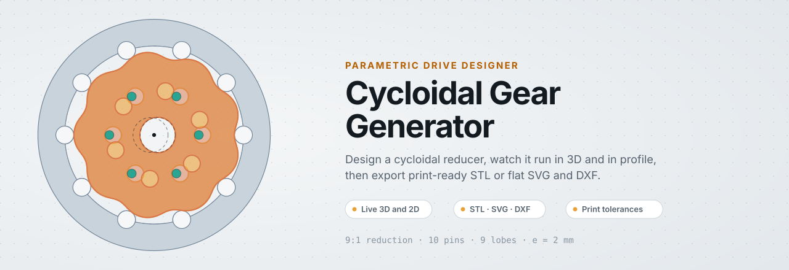
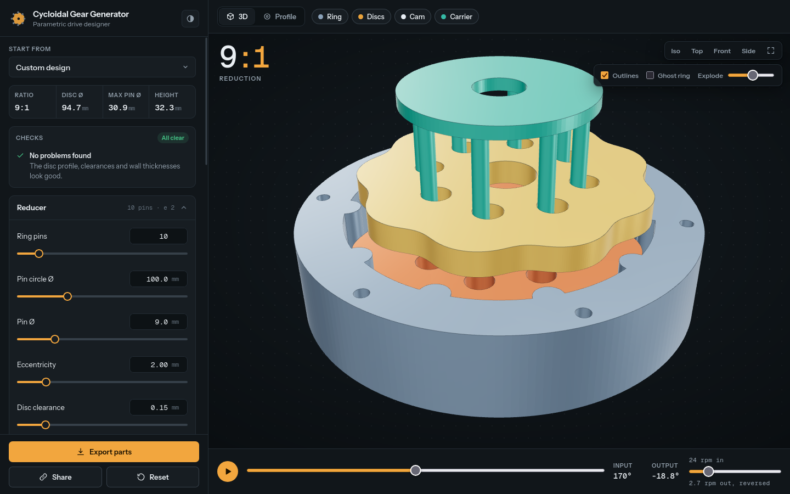
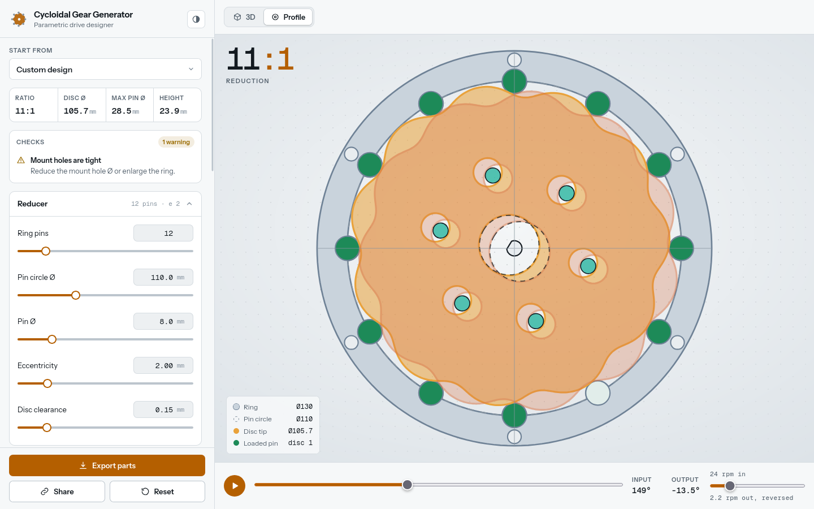
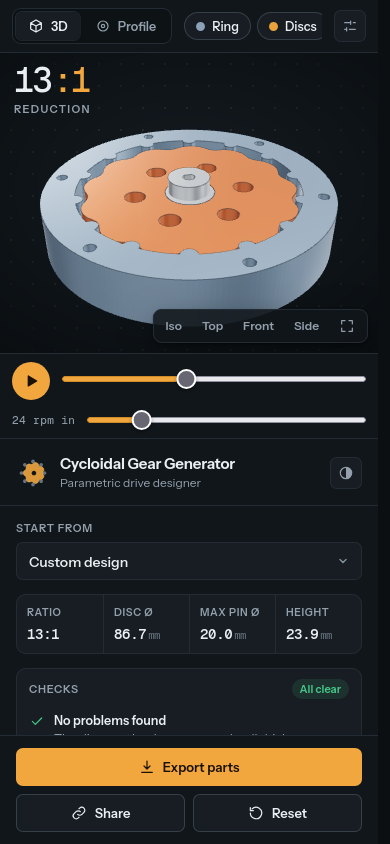
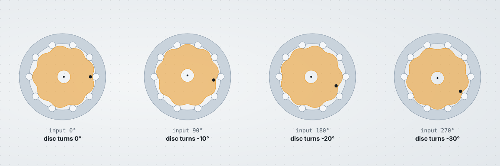
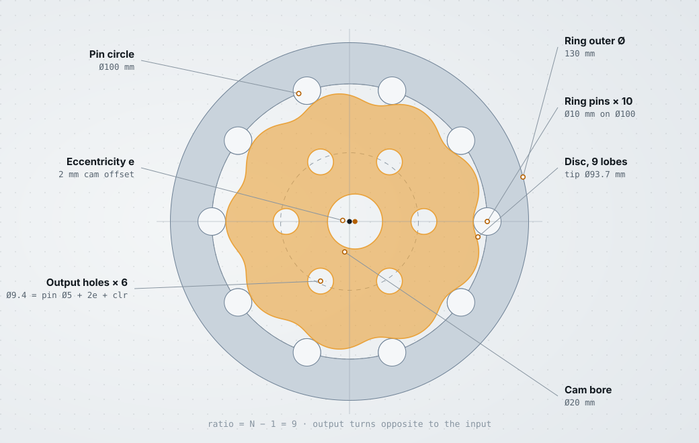

<p align="center">
  <picture>
    <source media="(prefers-color-scheme: dark)" srcset="docs/hero-dark.svg">
    
  </picture>
</p>

<p align="center">
  <a href="https://yigitsalihemecen.github.io/Cycloidal_Gear_Generator/"><b>Open the app</b></a> ·
  <a href="#quick-start">Quick start</a> ·
  <a href="#features">Features</a> ·
  <a href="#parameters">Parameters</a> ·
  <a href="#printing-and-assembly">Printing</a> ·
  <a href="#how-it-works">How it works</a>
</p>

A browser tool for designing cycloidal reducers. Change a few numbers, watch the drive run in 3D and in profile, check the design for problems, and export parts for a 3D printer, laser cutter or CNC. Everything runs locally in the page. There is no server and no account.

<p align="center">
  
</p>

## Features

**Design**
- Ratio from 3:1 to 59:1 (`N − 1` for `N` ring pins), one to four phased discs.
- Ring pins fused into the ring, or separate roller pins in printed sockets.
- Eccentric cam with a round or D-flat shaft hole, and an output carrier with its pins.
- Print tolerances for the disc, the pin sockets, the output holes and the cam.
- Five presets, from a single-disc starter to a 20:1 roller-pin drive.

**Preview**
- Live 3D view with orbit, camera presets, part toggles, ghost ring, outlines and an explode slider.
- A top-down profile view that highlights the pins carrying load.
- Real kinematics: the discs orbit, counter-rotate and drive the carrier, at the input speed you choose. The readout shows input and output angle and rpm.

**Checks**
- Detects undercut from the true curvature of the profile and reports the largest pin that is still valid.
- Warns about overlapping pins and output holes, thin ring walls, a bore that is too large, and weak cam walls.
- While a design is invalid the preview keeps the last good one, so the screen never goes blank.

**Export**
- Binary STL, one file per part, laid in its print orientation (the carrier is flipped so its pins point up).
- SVG and DXF cut profiles in millimetres for the discs and the ring.
- A ZIP with the files, a bill of parts and the parameter string.
- Every design is a link. The parameters live in the URL hash, so the **Share** button copies a design you can send to someone.

<p align="center">
  
</p>

The layout is responsive. On a phone the preview stays pinned at the top while the controls scroll underneath.

<p align="center">
  
</p>

## Quick start

```bash
git clone https://github.com/YigitSalihEmecen/Cycloidal_Gear_Generator.git
cd Cycloidal_Gear_Generator
npm install
npm run dev
```

Open the address Vite prints, usually `http://localhost:5173`. It needs Node 20.19 or newer.

| Script | What it does |
| --- | --- |
| `npm run dev` | Start the dev server |
| `npm run build` | Type-check, then build to `dist/` |
| `npm test` | Run the maths and geometry tests |
| `npm run lint` | Lint with oxlint |
| `npm run art` | Regenerate the SVG artwork in `docs/` and the favicon |

## How it works

A cycloidal drive has a fixed ring of pins and a disc with one lobe fewer than the ring has pins. A cam pushes the disc around the axis in a small circle. Because the lobes keep rolling against the pins, the disc itself turns slowly the other way. The output carrier picks that slow rotation up through pins that sit in oversized holes in the disc.

<p align="center">
  <picture>
    <source media="(prefers-color-scheme: dark)" srcset="docs/frames-dark.svg">
    
  </picture>
</p>

Each quarter turn of the input moves the marked disc by `−360° / 4 / 9 = −10°`. That is the 9:1 reduction.

<p align="center">
  <picture>
    <source media="(prefers-color-scheme: dark)" srcset="docs/anatomy-dark.svg">
    
  </picture>
</p>

### The maths

With `R` the pin circle radius, `rp` the pin radius, `e` the eccentricity and `N` the number of pins, the disc outline for `t` in `[0, 2π)` is

```
ψ(t) = atan2( sin((1 − N)·t),  R / (e·N) − cos((1 − N)·t) )
x(t) =  R·cos t − rp′·cos(t + ψ) − e·cos(N·t)
y(t) = −R·sin t + rp′·sin(t + ψ) + e·sin(N·t)
```

where `rp′ = rp + clearance`, which shrinks the disc slightly so printed parts do not bind.

- **Pose.** For an input angle `a` the disc centre sits at `e·(cos a, sin a)` and the disc is rotated by `−a / (N − 1)`. The tests check this against every pin, for every preset, and require the gap to equal the clearance.
- **Output holes.** A hole has radius `output pin radius + e + clearance`. Disc `k` of `n` is phased `2πk / n` around the cam, so its holes are rotated by `phase / (N − 1)` in its own frame. That keeps the output pins at the same place for every disc.
- **Undercut.** The disc is the pin-centre epitrochoid offset inwards by `rp′`, so it grows a cusp once `rp′` reaches the smallest convex radius of curvature. The app computes that curvature and shows the limit as *Max pin Ø*. The pins must also fit between each other, so the limit is also capped by the pin spacing `2·R·sin(π / N)`.
- **Ring bore.** The wall between the pins sits at `max(R, disc tip + e + 0.2 mm)`, so the lobes never touch it.

## Parameters

All lengths are in millimetres.

| Group | Parameter | Meaning |
| --- | --- | --- |
| Reducer | Ring pins `N` | Ratio is `N − 1` |
| | Pin circle Ø | Circle through the pin centres |
| | Pin Ø | Rolling pin diameter |
| | Eccentricity `e` | Cam offset; must keep `e·N < R` |
| | Disc clearance | Gap between disc and pins |
| Discs | Discs | 1 to 4, phased evenly |
| | Disc thickness, Disc gap | Axial size and spacing |
| | Cam bore Ø | Centre hole for the cam or a bearing |
| Output | Output pins, Ø, pitch Ø | The pins that carry the output |
| | Hole clearance | Radial clearance in the disc holes |
| Outer ring | Pin style | Fused into the ring, or separate roller pins |
| | Ring outer Ø, Ring overhang | Ring size and extra height per side |
| | Socket fit | Extra socket radius for roller pins |
| | Mount holes, Ø | Bolt holes through the ring |
| Input cam | Cam clearance, Shaft Ø, Shaft hole | Cam lobe fit and shaft hole (D-flat or round) |
| Carrier | Carrier thickness | Plate that holds the output pins |
| Mesh | Resolution | Draft, standard or fine STL curves |

## Printing and assembly

1. Start with a **disc clearance** of 0.15 to 0.25 mm on a typical FDM printer. Print one disc and check that it spins freely around the pins before you print the rest.
2. Print discs and the ring flat. Use four or more walls. Discs 2 and up have the same outline as disc 1, with the holes at their own phase, so keep the numbering.
3. Press a bearing into each disc bore, or run the cam straight in the bore with a little grease. The bore size is the **Cam bore Ø** parameter.
4. For roller pins, cut steel rod to the ring thickness shown in the bill of parts and push it into the sockets.
5. Slide the carrier on so its pins enter the disc holes, then fit the input shaft in the cam.

The outputs rotate opposite to the input. Higher ratios use more pins; keep `e` small enough that the lobes stay smooth, and keep an eye on the Checks panel.

## Project layout

```
src/
  core/        Pure maths and no DOM: params, profiles, kinematics, checks, SVG and DXF
  three/       Three.js scene, part geometry and binary STL writer
  components/  React UI: sidebar, stage, 2D profile, export dialog
  state/       URL-hash state, theme, playback clock
  export/      ZIP and file bundling
scripts/       Generates the README artwork from the same maths
```

The animation runs outside React. A small playback clock updates the 3D scene and the SVG transforms directly, so dragging a slider never fights a 60 fps render loop.

## Deploying

Pushing to `main` runs the checks and publishes `dist/` with GitHub Pages. In the repository settings, set **Pages → Source** to **GitHub Actions** once. The build uses relative paths, so it also works from any static host or folder.

## License

MIT. See [LICENSE](LICENSE).
